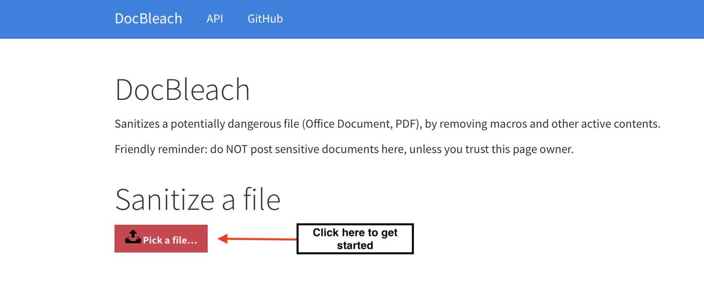
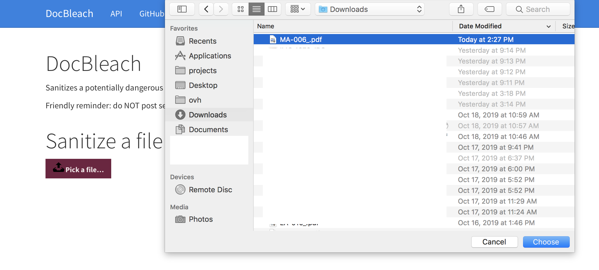
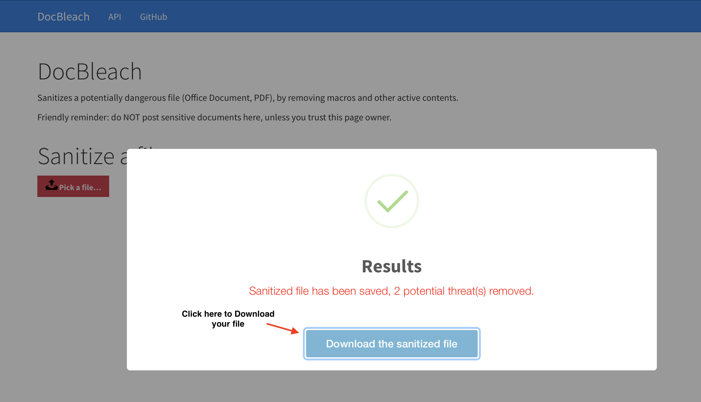

# DocBleach aaS - Sanitize your documents in the cloud™
 
[DocBleach][github] allows you to sanitize your Word, Excel, PowerPoint, PDF, ... documents. This repository contains the
DocBleach Web API, packaged as a docker service. Two clicks and you'll feel safer.

[](https://www.codacy.com/app/DocBleach/DocBleach-Web?utm_source=github.com&amp;utm_medium=referral&amp;utm_content=docbleach/DocBleach-Web&amp;utm_campaign=Badge_Grade)

You have files to sanitize but you can't install Java, may it be because you run on an embedded system or you deploy
your PHP app on a shared hosting and Java is not available ... This package is the solution to your issues!

# Installation

Three modules are present in this repository: 
- *api*
  contains the Web API, a lightweight Python Flask app that
  receives the files and responds to status requests.
- *worker* contains DocBleach and launches it using Python Celery.
- *autoscale* auto-scaling for Mesos Marathon, documentation still has to be written.

Thanks to Docker, you are able to easily deploy this app.

Celery requires a message broker and a backend to store its results.
Using something as easy to setup as Redis is fine, as it is able to serve
both roles, but you may use [another broker][1] or another [backend storage][backend_celery].

Configuration is given to each component thru environment variables,
namely `CELERY_BROKER` and `CELERY_RESULT_BACKEND`. They accept URI as
valid values, for instance to use a local Redis server protected by the
password `PASS123` you would use this:
`CELERY_BROKER=redis://:PASS123@127.0.0.1/`.

In order to pass the files from the API to the Worker, a storage backend is required.
Plik is used, because it is easy to setup (unlike OpenStack/AWS), Open-Source and supports `expire` out of the box.

By default using Docker Compose, an internal Plik instance is started and the sanitized files are stored on plik.root.gg

You may change this using the `INTERNAL_PLIK_SERVER` and `FINAL_PLIK_SERVER` env variables.
  
# Howto's
To run the containers using Docker Compose, just call `docker-compose up -d` in this project's directory.
Docker will take care of the boring stuff for you! :)
```bash
$ docbleach-rest$ docker-compose up -d
  Starting docbleachrest_worker_1
  Starting docbleachrest_plik_1
  Starting docbleachrest_web_1
  Starting docbleachrest_redis_1
$ docker ps
CONTAINER ID        IMAGE                                         COMMAND                  CREATED              STATUS              PORTS                              NAMES
5d258cfac1d6        docbleach/api:latest      "/usr/src/app/entrypo"   About a minute ago   Up 41 seconds       0.0.0.0:9000->5000/tcp             docbleachrest_web_1
5c3d91acba01        docbleach/worker:latest   "/usr/src/app/entrypo"   About a minute ago   Up 41 seconds                                          docbleachrest_worker_1
ebcef5f636d5        rootgg/plik                                   "/bin/sh -c ./plikd"     9 days ago           Up 41 seconds       8080/tcp                           docbleachrest_plik_1
eb69034e73f5        redis                                         "docker-entrypoint.sh"   10 days ago          Up 41 seconds       6379/tcp                           docbleachrest_redis_1
```

As you can see, DocBleach-api is running on your port `5000`.
Just open `127.0.0.1:5000` in your browser to try it out :wink:.

 
## Get the sources
 
```bash
    git clone https://github.com/docbleach/DocBleach-Web.git
    cd DocBleach-Web 
```

A `Dockerfile` makes it easy to hack on a part of this project. 

You've developed a new cool feature ? Fixed an annoying bug ? We'd be happy
to hear from you !
 

Documentation uses [Swagger][swagger], and thus is rendered client-side using the specifications in
`api/static/swagger.yaml`.

# How to Sanitize

to start sanitizing your file, click on the "pick a file" button

then choose the file you want to sanitize

Finaly, click "Download the sanitized file" to get your file back


# Related links
 
 * Contribute: https://github.com/docbleach/DocBleach-Web
 * Report bugs: https://github.com/docbleach/DocBleach-Web/issues
 * Get latest version: https://hub.docker.com/u/docbleach/
 
# License
 
See https://github.com/docbleach/DocBleach-Web/blob/master/LICENSE

# Project status

This project works, but would be greatly improved with little tweaks.

For instance, it would be really great to:
- Write more documentation, because there's never enough of it. :-(
- Have an improved design. 
- Improve the API once the [code base is rewamped](issue_codebase), to give an extended output, allow configuration...
- Remove dependencies, having Java and Python code in a docker file is a bad practice. For now, it works.


[1]: http://docs.celeryproject.org/en/latest/getting-started/brokers/
[backend_celery]: http://docs.celeryproject.org/en/latest/getting-started/first-steps-with-celery.html#keeping-results
[swagger]: https://swagger.io/
[github]: https://github.com/docbleach/DocBleach
[logo_link]: https://github.com/docbleach/DocBleach/404
[issue_codebase]: https://github.com/docbleach/DocBleach/issues/2
